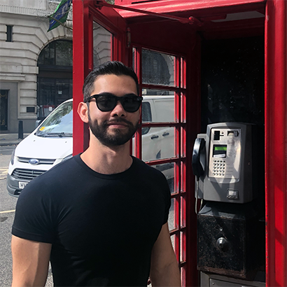
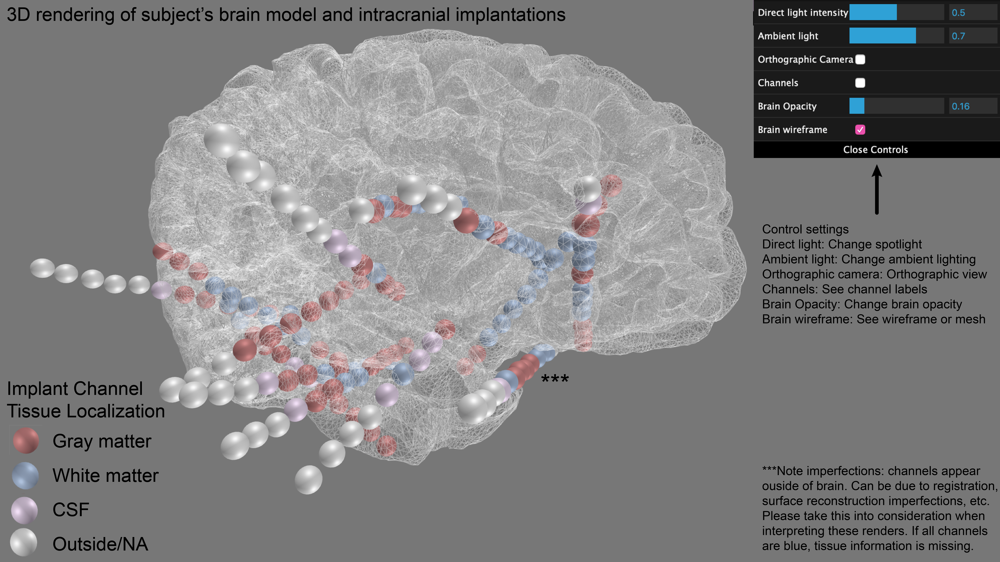
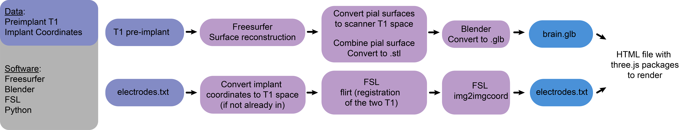

Made by Andy Revell (Fifth-year MD/PhD student at Penn): 

  

# Implant Links

_no identifying information is present_

**Click to view implant:**

| Subjects                                    |
| :-----------------------------------------  | :-----------------------------------------  | :-----------------------------------------  | :-----------------------------------------  | :-----------------------------------------  |
| RID0031                                     | RID0037                                     | RID0046                                     | RID0089                                     | RID0131                                     |
| [RID0139](./renders/sub-RID0139/index.html) | RID0146                                     | RID0186                                     | RID0194                                     | RID0206                                     |
| [RID0213](./renders/sub-RID0213/index.html) | RID0218                                     | RID0230                                     | RID0238                                     | RID0240                                     |              
| RID0241                                     | RID0250                                     | RID0252                                     | RID0259                                     | RID0267                                     |
| RID0272                                     | RID0274                                     | [RID0278](./renders/sub-RID0278/index.html) | RID0279                                     | RID0280                                     |
| RID0295                                     | RID0296                                     | RID0307                                     | RID0309                                     | RID0317                                     |      
| RID0320                                     | RID0322                                     | RID0325                                     | RID0328                                     | RID0329                                     | 
| RID0330                                     | RID0332                                     | RID0334                                     | RID0337                                     | RID0338                                     |    
| RID0341                                     | RID0356                                     | RID0357                                     | [RID0365](./renders/sub-RID0365/index.html) | RID0371                                     |     
| RID0380                                     | RID0381                                     | RID0382                                     | RID0385                                     | RID0386                                     |  
| RID0392                                     | RID0394                                     | RID0405                                     | RID0412                                     | RID0420                                     | 
| RID0424                                     | RID0440                                     | RID0442                                     | RID0452                                     | [RID0454](./renders/sub-RID0454/index.html) | 
| RID0459                                     | RID0472                                     | RID0475                                     | RID0476                                     | [RID0490](./renders/sub-RID0490/index.html) |    
| [RID0502](./renders/sub-RID0502/index.html) | [RID0508](./renders/sub-RID0508/index.html) | RID0517                                     | [RID0520](./renders/sub-RID0520/index.html) | RID0522                                     |
| RID0522                                     | RID0529                                     | RID0530                                     | [RID0536](./renders/sub-RID0536/index.html) | RID0560                                     |
| RID0562                                     | RID0566                                     | [RID0572](./renders/sub-RID0572/index.html) | RID0582                                     | [RID0583](./renders/sub-RID0583/index.html) |
| RID0588                                     | RID0589                                     | [RID0595](./renders/sub-RID0595/index.html) | [RID0596](./renders/sub-RID0596/index.html) | RID0646                                     |
| RID0647                                     | [RID0648](./renders/sub-RID0648/index.html) | RID0649                                     | RID0650                                     | RID0651                                     |
| RID0652                                     |                                             |                                             |                                             |                                             |

# About

These renders show implantations of epilepsy patients. Implantations were done for clinical purposes and to capture seizure activity. Click on the subject links in the table above to view the renders. You can adjust your view using your mouse and control settings (see below image). On mobile, toggle off "Brain wireframe" for quicker view adjustments. Click on "Channels" to see the channel label names. Spheres represent implanted electrode channels. The center of each sphere corresponds to the coordinate of each channel. Each spehere is arbitrarily 2.2 mm in radius. The coordinates of each channel is localized to specific brain tissue: gray matter (GM), white matter (WM), cerebrospinal fluid (CSF), or outside the brain area. 

Colored spheres correspond to these areas:

RED: GM

BLUE: WM

PURPLE: CSF

WHITE: OUTSIDE (or not localized to any area)
 

#### Note on channel tissue localization:
The tissue type corresponding to each channel is determined by the SINGLE voxel the channel coordinate is in, and thus subject to errors.

Example: a specific voxel is determined to be GM through the FIRST and FAST FSL algorithms (see figure below). The channel is localized to that voxel. However, all surrounding voxels happen to be WM. It could be assumed then that the tissue type of that particular channel was determined to be wrong in this case - because all surrounding voxels of that channel are WM. Furthermore, tissue localization for ECoG (grids and strips) may not be necessarily correct. They can be assumed to be in CSF overlaid on GM cortical structures.

The FIRST and FAST algorithms have a smoothing factor to mitigate this issue to some extent. Please take this into consideration when relying on the specifc tissue type of each channel when interpreting these localizations. See this image below for an overview of the localization procedure: 

Figure legend: Electrode localization and Tissue Segmentation. Each channel is localized to a specific tissue type shown by the figure above. (1) A CT is acquired of the implantation. (2) The coordinates of each channel is determined through our clinical localization pipeline, and registered to an implant image (3) and a preimplant image (4). Using the preimplant image, tissue type is determined using FSL's FIRST and FAST algorithms. Output of the cortical segmentation (FAST) is shown in (5) and output of the subcortical segmentation (FIRST) is shown in (6). These images are combined (7). The electrode coordinates are determined in preimplant space using FSL's linear registration (not non-linear - the figure is wrong here and will be updated). The exact coordinate of the electrode channel is matched to a voxel in the tissue segmentation combined image (7) and thus the type of tissue the channel is sampling from is determined. WARNING: This method does not consider surrounding voxels, and thus a channel may be erroneously determined to be sampling from the wrong tissue in rare cases.

# Metadata

| Subjects| Implant     |  Sampling  | T1 scan used for surface  |                                
| :------ | :---------- | :--------- | :------------------------ |
| RID0139 | SEEG        | bilateral  | research 3T protocol      |
| RID0213 | ECoG        | bilateral  | research 3T protocol      |
| RID0278 | SEEG        | bilateral  | research 3T protocol      |
| RID0365 | SEEG        | bilateral  | research 3T protocol      |
| RID0454 | SEEG        | bilateral  | research 3T protocol      |
| RID0490 | SEEG        | bilateral  | research 3T protocol      |
| RID0502 | SEEG        | bilateral  | research 3T protocol      |
| RID0508 | SEEG        | left       | research 3T protocol      |
| RID0520 | SEEG + ECoG | left       | research 3T protocol      |                                 
| RID0536 | SEEG        | bilateral  | research 3T protocol      |
| RID0572 | SEEG        | right      | research 3T protocol      |
| RID0583 | SEEG        | left       | research 3T protocol      | 
| RID0595 | SEEG        | left       | research 3T protocol      |
| RID0596 | SEEG        | left       | research 3T protocol      |
| RID0648 | SEEG        | left       | research 3T protocol      |

SEEG: Stereoelectroencephalography ("toothpicks")

ECoG: Electrocorticography ("grids and strips")

# Methods

### Visual

### Bullet Point Methods

See [revellLab GitHub repository electrodeLocalization.py](https://github.com/andyrevell/revellLab/blob/main/packages/imaging/electrodeLocalization/electrodeLocalization.py) for example pipeline

1. Step 1: Creation of brain 3D model
	- Data needed:
		- Pre-implant T1 image. 
		- Preferably at 3T
		- Preferably using our high resolution 3T research protocol (not all patients acquire this image)
	- Software needed:
		- Freesurfer
		- Blender 3.9
		- Python 3.7+
		- Script blender_compress_mesh.py from [revellLab GitHub repository](https://github.com/andyrevell/revellLab)
	- Step 1.1: Cortical surface reconstruction of brain 
		- Software: Freesurfer
		- Command: recon-all -subjid ### -all -time -log logfile -nuintensitycor-3T -sd ### -parallel -threads 12
		- Takes about 1.5-2hrs for Andy's computer (AMD Ryzen 9 3900X 12-Core Processor, 64 GB RAM, Titan RTX GPU)
	- Step 1.2: Make 3D model
		- Convert lh.pial and rh.pial to scanner T1 space
			- Freesurfer command: mris_convert --to-scanner lh.pial lh.pial
		- Combine lh.pial and rh.pial AND convert to .stl 3D model file
			- reesurfer command: mris_convert --combinesurfs rh.pial lh.pial combined.stl
		- Convert to .stl to .glb file (To render on webpage using three.js)
			- Software: Blender 3.9
			- Use python script blender_compress_mesh.py from [revellLab GitHub repository](https://github.com/andyrevell/revellLab/blob/main/packages/imaging/electrodeLocalization/blender_compress_mesh.py)
			- Command: blender --background --factory-startup --addons io_scene_gltf2 --python blender_compress_mesh.py -- -i combined.stl -o brain.glb
			
2. Step 2: Get implantation coordinates
	- Data needed:
		- Pre-implant T1 image (from above)
		- Coordinates in the pre-implant T1 space above
			- If coordinates in a different space, need the corresponding T1 image and register the pre-implant T1 image above
		- Optional: output of [atlas localization pipeline](https://github.com/andyrevell/revellLab/blob/main/packages/atlasLocalization/atlasLocalization.py) to get tissue localization information of implant channels
	- Software needed:
		- FSL
		- Python 3.7+
	- Step 2.1: Register the pre-implant T1 image to the T1 image the coordinate file is in - skip if they are the same
		- Brain extract the images using FSL bet
		- Linear registration of the two images using FSL flirt
		- Apply the returned tranformation matrix from flirt to the coordinate file
			- FSL command: img2imgcoord -src ### -dest ### -xfm ### -mm ### > ###
			- See FSL's documentation of img2imgcoord for specific data sctructures files must be in
	- Step 2.2: Save coordinates in same location as the brain.glb file, name it electrodes.txt
		- electrodes.txt format
			- each row contains channel information. Column 1: Channel name; Column 2: x coordinate; Column 3: y coordinate; Column 4: z coordinate
			- Separation is a single space between columns (not comma or tab separated)
3. Step 3: Get necessary files in single directory:
	- See [example](https://github.com/andyrevell/implantRenders/tree/main/renders/sub-RID0278) 
	- File names:
		- brain.glb
		- electrodes.txt
		- index.html [Get here]( https://github.com/andyrevell/revellLab/blob/main/tools/threejs/index.html)  
	- These three files are all you need, and the html file should work provided you name the .glb and .txt files accordingly
	- To run on local computer, follow [these directions](https://threejs.org/docs/#manual/en/introduction/How-to-run-things-locally) 
		- I installed npm: npm install http-server -g (I forget if you need this to run the python -m http.server below)
		- python -m http.server
		- Type this into browser (I used Chrome, Firefox, and Microsoft Edge): http://localhost:8000/
		- The reason why you need the above is because web browser restrict loading of the 3D .glb files locally for security reasons.
				
			
			
			
			
			
			
			
			
			
			
			
			
			
			
			
			
			
			
			
